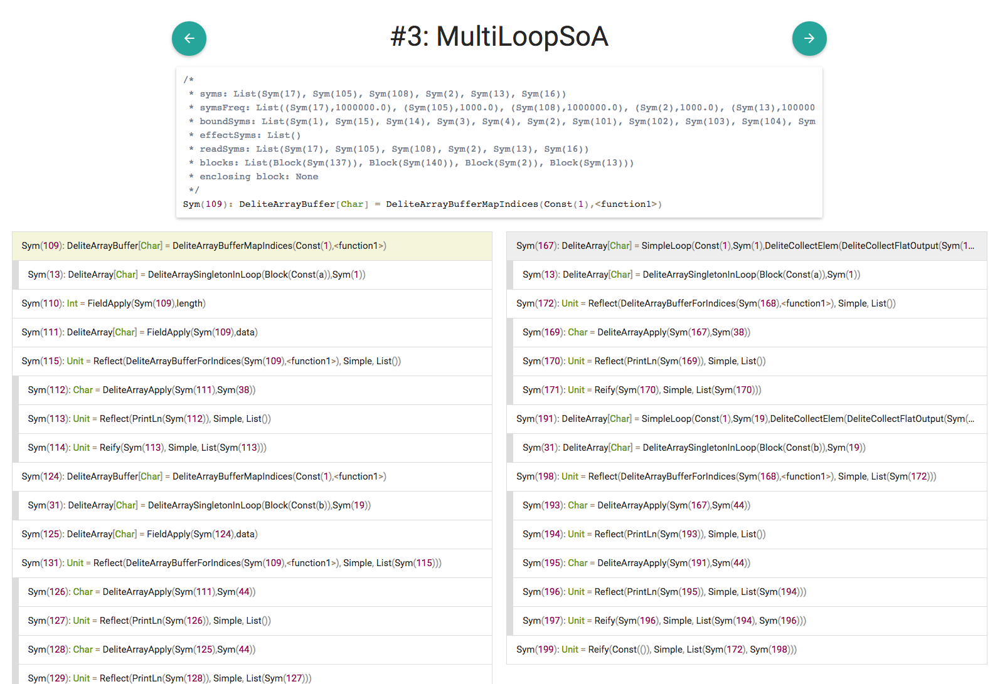

# lms-visualisation

This project is aimed at providing useful insights into lms staging pipelines.
It provides in browser interactive visualisations of chains of transformations and helps understand what are the kind of operations each transformation is performing.

## Usage
To use, create a `compilation.min.json` file with the right format (see below). Then run:

```bash
sbt "; lmsvizJS/fastOptJS; lmsvizJVM/run";
```

This should generate an `index.html` file that you can open in your favorite browser.

You should get something that looks like this:


## Features
- Every statement is clickable and will display all it's information in the overhead box
- Clicking on statements that contain sub scopes will expand them
- Clicking on any statement will make the statement appear beige and all related* statements appear grey

*Related statements are discovered through the source context information. Since we are treating the transformers as black boxes, this is a good (although not exact) way to approximate which transformed statement on the right corresponds to the original statement on the left (and vice versa).

## Caveats
The javascript VM doens't provide access to the local filesystem, so there are two solutions to load the trace:

1. Create a webserver that serves the file to the page
2. Load the trace at compile time

We decided to go for the second option for now, and use a macro to load the content of the trace file as a `String` in the source of the main class.  There is a problem with this strategy however, because sbt cannot track this kind of dependency (or I haven't found how to make it).

To solve it we created two scripts that you can run to recompile the code:

- `recompile.sh` Will check for a change in the trace file, invalidate the main file and recompile the project
- `auto_reload.sh` Can watch for changes of a file of your choice and run `recompile.sh` automatically.

## Trace format
To create a visualisation, we first have to generate an lms execution trace. The trace is just a sequence of `TransformInfo` objects that constitute the compilation. The full model is described in [org.lmsviz.model.lms](https://github.com/Stanford-PDM/lms-visualisation/blob/master/shared/src/main/scala/org/lmsviz/model/lms.scala) :

```scala
case class TransformInfo(name: String, before: Seq[StmInfo], 
      after: Seq[StmInfo])

case class StmInfo(id: Int, repr: String, pos: Seq[SourceLocation],
      comments: Seq[String], parentId: Option[Int],
      childrens: Seq[StmInfo])
      
case class SourceLocation(file: String, line: Int, offset: Int,
      parent: Option[SourceLocation])
```

There is currently only support for JSON serialization, using [circe](https://github.com/travisbrown/circe)'s automatic decoders.


## lms support
You can automatically generate the right trace format by using: [ExportTransforms.scala](https://github.com/Stanford-PDM/virtualization-lms-core/blob/dengels-fusion/src/util/ExportTransforms.scala)

